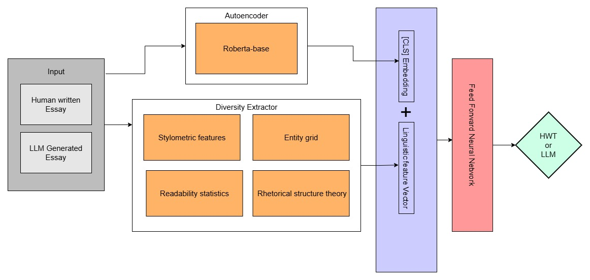
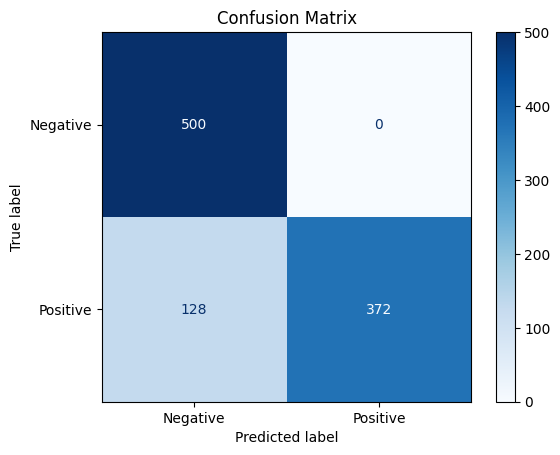
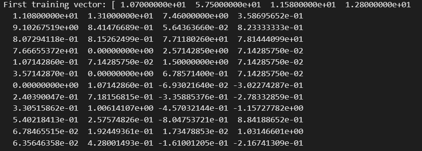
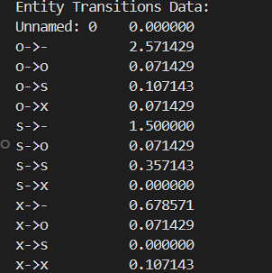
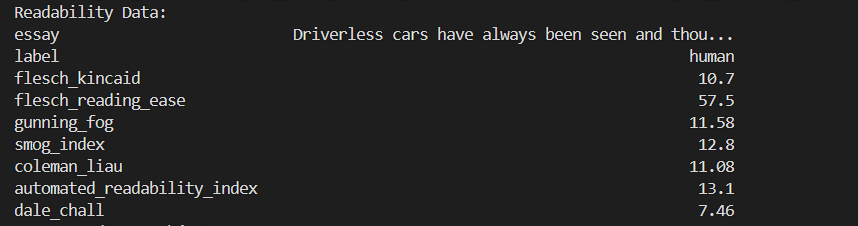
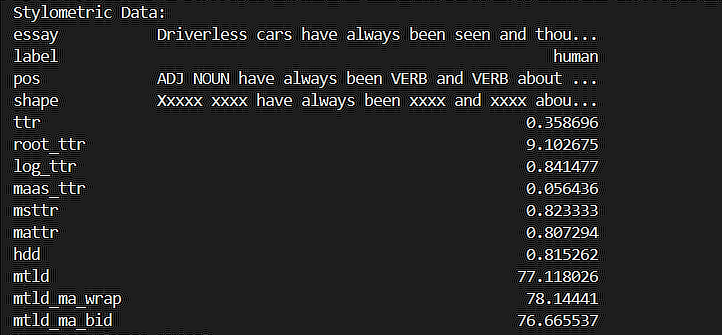

<div align="center">

# 🤖 Robust-Classification-of-Human-written-vs-LLM-Generated-Essay

[](https://opensource.org/licenses/MIT)
[](https://www.python.org/downloads/release/python-380/)

*An advanced Feed-Forward Neural Network approach to distinguishing between LLM-generated and human-written Essays*

</div>

---

## 📊 Performance Metrics

<div align="center">

| Metric | Score |
|--------|-------|
| Accuracy | 87.2% |
| Precision | 100% |
| Recall | 74.4% |
| F1-Score | 85.3% |

These metrics demonstrate the model's capability to distinguish between human-written and AI-generated texts effectively.
</div>


## 🎯 Overview

This project aims to classify human-written and AI-generated texts using a machine learning-based approach. It focuses on distinguishing between text produced by Large Language Models (LLMs) and human authors based on their stylistic and lexical features.

The model leverages a **Feed-Forward Neural Network (FFNN)** that combines fine-tuned autoencoder embeddings with linguistic features (e.g., readability, stylometry, and lexical diversity) for binary classification. The goal is to provide an effective framework for detecting AI-generated content in a variety of textual domains.

## ✨ Key Features

### Feature Extraction Pipeline

#### Readability Metrics
- Flesch-Kincaid Grade Level
- Flesch Reading Ease
- Gunning Fog Index
- SMOG Index

#### Stylometric Features
- Unigram/Bigram analysis
- Punctuation pattern recognition
- Stopword usage patterns
- Spelling pattern analysis
- Fine-grained stylistic markers

#### Lexical Diversity Measurements
- Type-Token Ratio (TTR)
- Maas TTR
- Hypergeometric Distribution (HDD)

#### Text Coherence Analysis
- Entity Grids
- Entity transitions across sentences
- Coherence pattern recognition

### Model Architecture

- **Base Architecture**: Feed-Forward Neural Network
- **Input Processing**:
  - Autoencoder embeddings
  - Integrated linguistic features
- **Optimization Techniques**:
  - Dropout layers
  - Batch normalization
  - Early stopping mechanisms
- **Training Focus**: Binary classification of text sources

## 📈 Visualizations

### Model Architecture

*Detailed view of FFNN architecture showing feature integration*
<div align="center">
An overview of the model architecture, showing how the autoencoder embeddings and linguistic features are integrated into the FFNN for classification.
</div>
### Performance Analysis

*Binary classification performance visualization*
<div align="center">
Visualization of the model's performance in terms of true positives, false positives, true negatives, and false negatives.
</div>
### Training Metrics
<div align="center">
<table>
<tr>
<td>
<br><em>Embedding Vector Training Progress</em></td>
<td>
<br><em>Entity Transition Analysis</em></td>
</tr>
<tr>
<td>
<br><em>Readability Metrics Evolution</em></td>
<td>
<br><em>Stylometric Feature Development</em></td>
</tr>
</table>
</div>

## 🔍 Dataset

The dataset consists of labeled essays or texts, with examples of both human-written and AI-generated content. The dataset is used to train, validate, and test the model, providing diverse linguistic features for robust classification.

## 🚀 Getting Started

### Prerequisites
```
Python 3.8+
pip package manager
```

### Installation

1. Clone the repository
```bash
git clone https://github.com/yogeshwaran10/Robust-Classification-of-Human-written-vs-LLM-Generated-Essay.git
cd Robust-Classification-of-Human-written-vs-LLM-Generated-Essay
```
## 📚 References

<div class="references">

### Core Detection Methods
1. **Stylometric Analysis in Social Media** *(Kumarage et al., 2023)*  
   Exploration of AI-generated text detection in Twitter timelines using stylometric features.  
   [`arXiv:2303.03697`](https://arxiv.org/abs/2303.03697)

2. **Holistic Content Detection** *(Markov et al., 2023)*  
   Comprehensive approach to undesired content detection presented at AAAI 2023.  
   In *Proceedings of the AAAI Conference on Artificial Intelligence, 37*, 15009-15018.

### Adversarial Approaches
3. **Emotion Detection Evasion** *(Bajaj & Vishwakarma, 2023)*  
   Study on adversarial attacks against text-based emotion detection systems.  
   *Neurocomputing, 558*, 126787.

4. **Neural-Statistical Feature Detection** *(Crothers et al., 2022)*  
   Analysis of adversarial robustness in transformer detection.  
   In *International Joint Conference on Neural Networks (IJCNN)*, 1-8.

### Advanced Detection Techniques
5. **LLM Essay Detection** *(Koike et al., 2024)*  
   OUTFOX: Novel approach using adversarially generated examples.  
   In *Proceedings of the AAAI Conference on Artificial Intelligence, 38*, 21258-21266.

6. **Adversarial Perturbation Analysis** *(Huang et al., 2024)*  
   Investigation of detector robustness against adversarial attacks.  
   [`arXiv:2406.01179`](https://arxiv.org/abs/2406.01179)

### Zero-Shot and Generalization
7. **Zero-Shot Detection** *(Pu et al., 2023)*  
   Study on zero-shot generalization capabilities of text detectors.  
   [`arXiv:2310.05165`](https://arxiv.org/abs/2310.05165)

8. **Paraphrasing and Defense** *(Krishna et al., 2024)*  
   Analysis of paraphrasing attacks and retrieval-based defense mechanisms.  
   *Advances in Neural Information Processing Systems, 36*.

### Text Classification and Evaluation
9. **Rule-Based Generation** *(Zhou et al., 2022)*  
   Exploration of adversarial sample generation techniques.  
   *Neural Computing and Applications, 34*(13), 10575-10586.

10. **Student Essay Detection** *(Peng et al., 2024)*  
    Evaluation of AI-generated student essay detection methods.  
    [`arXiv:2402.00412`](https://arxiv.org/abs/2402.00412)

</div>

---
## 🔮 Future Development

- [ ] Advanced Embeddings
  - Integration of transformer-based models (GPT, T5)
  - Enhanced semantic representations

- [ ] Multi-task Learning
  - Paraphrase detection integration
  - Text summarization capabilities

- [ ] Knowledge Integration
  - Knowledge graph implementation
  - Enhanced reasoning capabilities
  - Adversarial text detection

- [ ] Architecture Optimization
  - Attention mechanisms
  - Transformer integration
  - Graph Neural Networks (GNNs)

- [ ] Data Enhancement
  - Multilingual text inclusion
  - Adversarial scenario expansion
  - Synthetic data generation

## 📄 License

This project is licensed under the MIT License - see the [LICENSE](LICENSE) file for details.

---

<div align="center">

### 🌟 Star us on GitHub — it helps!

[Report Bug](https://github.com/yourusername/AI-vs-Human-Text-Classification/issues) · [Request Feature](https://github.com/yourusername/AI-vs-Human-Text-Classification/issues)

</div>
